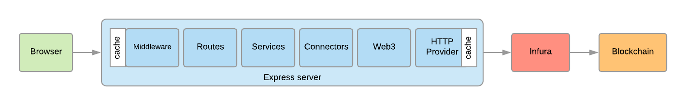

# Express Web Server

This is a web server connecting to the blockchain though the Dirt API.

## Cache

Location | Description | Duration
---- | ---- | ----
Route | `/registries` | one hour
Route | `/registries/{registry_address}` | 10 minutes
Http provider | `net_version` | life of the application 
Http provider | `eth_getCode` | life of the application

## Starting the Web server

1. Get an Infura API key at [infura.io](infura.io).

2. Set the environment variables using `.env`

Variable | Description
---- | ----
NODE_ENV | Node environment (for example `development`, `test` or `production`)
INFURA_ENDPOINT | Ropsen Infura endpoint (for example `https://ropsten.infura.io/v3/cc....` (required)
ROOT_ADDRESS | Dirt root address, for example `0xDb1E8F93854cbC9272dA69544Fc62E5d4511c7D1` (required)
PORT | For example, `3001` (default to `3001`)

3. Install the packages

`npm run install`

4. Start the web server

Development:
`npm run dev`

Production:
`npm start`

5. Connect to the `api`, default [http://localhost/:3001/](http://localhost/:3001/)

*Tip*: You can use the Insomnia [workspace](../tools/insomnia)

*Tip*: Bypass the Express cache by setting the HTTP header `x-apicache-bypass` to true.

## Test

`npm run test`

## Lint

`npm run lint`